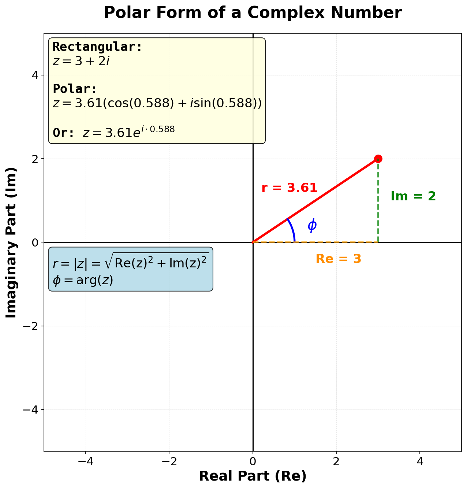
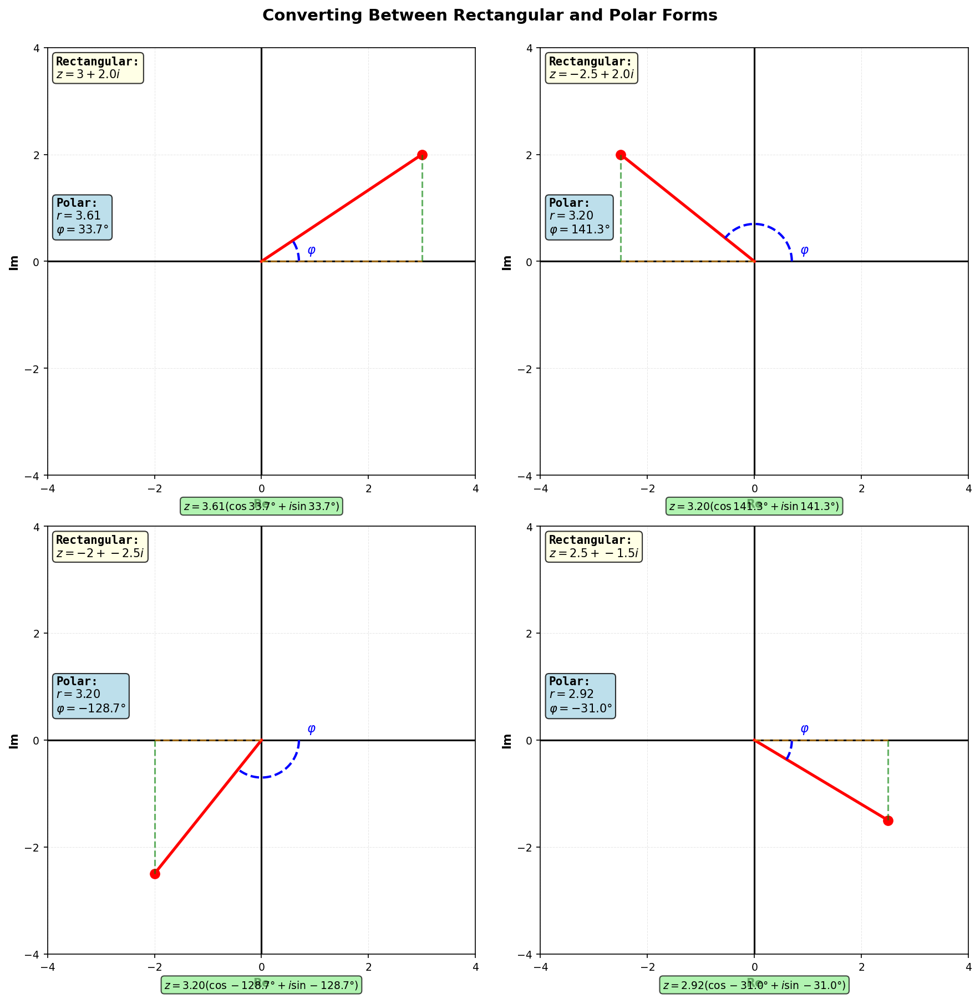

For a complex number $z = x + iy$, the polar form is:

$$
z = r(\cos \phi + i \sin \phi)
$$

where:
- $r = |z| = \sqrt{x^2 + y^2}$ is the modulus (the distance from the origin to $z$)
- $\phi = \arg(z)$ is the argument (the angle from the positive real axis)

An alternative representation of the polar form uses Euler's formula:

$$
z = re^{i\phi}
$$

# Relationship to Rectangular Form

The connection between rectangular and polar forms comes from the definitions of sine and cosine:

$$
\cos \phi = \frac{x}{r}\\
\sin \phi = \frac{y}{r}
$$

Rearranging:

$$
x = r \cos \phi\\
y = r \sin \phi
$$

This means:

$$
z = x + iy = r \cos \phi + ir \sin \phi = r(\cos \phi + i \sin \phi)
$$

## Converting from Rectangular to Polar

Given $z = x + iy$, to find the polar form:

1. Compute the modulus: $r = \sqrt{x^2 + y^2}$
2. Compute the argument: $\phi = \arctan(y/x)$ (with quadrant adjustments)
3. Write: $z = r(\cos \phi + i \sin \phi)$

## Converting from Polar to Rectangular

Given $z = r(\cos \phi + i \sin \phi)$, to find the rectangular form:

1. Compute $x = r \cos \phi$
2. Compute $y = r \sin \phi$
3. Write: $z = x + iy$

# Examples in All Quadrants

Here are examples of conversions in each quadrant:

# Why Use Polar Form?

The polar form is particularly useful for:

- **Multiplication and division**: Polar forms multiply and divide more easily than rectangular forms.
- **Powers and roots**: Raising a complex number to a power or finding roots is much simpler using De Moivre's theorem, which applies to polar form.
- **Geometric interpretation**: The polar form immediately shows the size ($r$) and direction ($\phi$) of a complex number, making geometric operations intuitive.
- **Exponential notation**: The form $z = r e^{i\phi}$ connects complex numbers to exponentials, which is fundamental in many areas of mathematics and engineering.

Both rectangular and polar forms represent the same complex number; choosing which to use depends on the task at hand.
